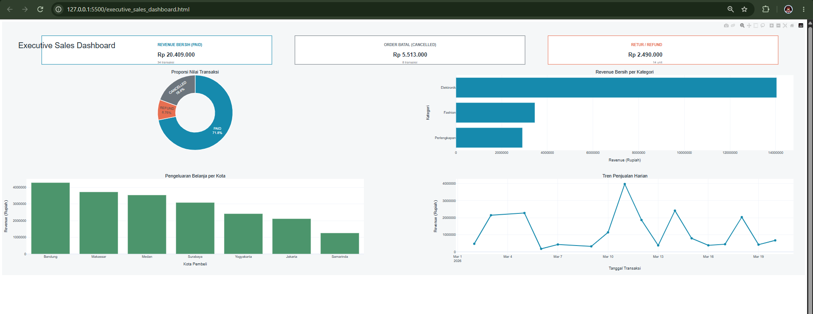

# E-Commerce Sales Pipeline & Interactive Plotly Dashboard

A Python-based analytics project that cleans raw transaction data, calculates sales KPIs, separates payment outcomes, and publishes an interactive Plotly dashboard for decision-makers.

## Dashboard Preview


## Problem Statement

Operational teams often receive data in inconsistent formats and spend too much time manually preparing reports. Common issues include:

- Duplicate orders that inflate revenue and transaction counts.
- Mixed date formats and missing transaction dates.
- Currency values stored as formatted text instead of numbers.
- Inconsistent category and payment-status labels.
- Limited visibility into successful, cancelled, and refunded transactions.

This project addresses those problems with an automated pipeline that standardizes raw data, produces reusable cleaned datasets, and publishes an interactive web dashboard.

## E-Commerce Sales Pipeline & Plotly Dashboard

The sales pipeline is implemented in `analyze_sales.py` and `visualize_all_metrics.py`.

The pipeline:

- Reads raw sales records from `sample_sales_50.csv`.
- Validates required columns.
- Removes duplicate orders using `order_id`.
- Parses multiple date formats and fills recoverable missing dates.
- Converts Indonesian Rupiah strings into numeric values.
- Normalizes category and payment-status labels.
- Calculates `total_harga` for each transaction.
- Exports separate datasets for `PAID`, `REFUND`, and `CANCELLED` transactions.
- Generates an interactive Plotly HTML dashboard.

The dashboard includes:

- Net paid revenue and transaction count.
- Cancelled-order value and count.
- Refund value and returned units.
- Revenue by product category.
- Revenue by buyer city.
- Daily revenue trend.
- Transaction-value distribution by status.

## Technology Stack

- **Python 3.10+**: Pipeline orchestration and business logic.
- **Pandas**: Data cleaning, transformation, aggregation, and CSV I/O.
- **Plotly**: Interactive executive web dashboard generation.

## Project Structure

```text
.
├── analyze_sales.py                 # Validate, clean, classify, and summarize raw sales data
├── generate_mock_sales.py           # Generate reproducible sample transaction data
├── visualize_all_metrics.py         # Build the interactive Plotly dashboard
├── sample_sales_50.csv              # Raw sample input
├── cleaned_sales_paid.csv           # Cleaned PAID transactions
├── sales_cancelled.csv              # CANCELLED transactions
├── sales_refunded.csv               # REFUND transactions
└── executive_sales_dashboard.html  # Generated interactive dashboard
```

## Installation

### Prerequisites

- Python 3.10 or newer
- Git

### Setup

```bash
git clone <your-repository-url>
cd <repository-directory>
python -m venv .venv
```

Activate the virtual environment:

**Windows PowerShell**

```powershell
.\.venv\Scripts\Activate.ps1
```

**macOS/Linux**

```bash
source .venv/bin/activate
```

Install the dependencies:

```bash
python -m pip install --upgrade pip
python -m pip install pandas plotly
```

## Usage

Run the complete workflow from the repository root.

### 1. Generate sample data (optional)

```bash
python generate_mock_sales.py
```

This creates a reproducible sample file containing successful, cancelled, refunded, duplicate, and partially incomplete records.

### 2. Clean and split the sales data

```bash
python analyze_sales.py
```

This produces:

- `cleaned_sales_paid.csv`
- `sales_cancelled.csv`
- `sales_refunded.csv`

It also prints a business summary covering revenue, top categories, top cities, refunds, and cancelled orders.

### 3. Generate the Plotly dashboard

```bash
python visualize_all_metrics.py
```

Open `executive_sales_dashboard.html` in a browser to explore the interactive charts.

## Data Automation Highlights

- **Schema validation:** Fails early when required fields are missing.
- **Deduplication:** Removes repeated orders based on a stable order identifier.
- **Robust date handling:** Supports several common date formats and flags unresolved values.
- **Currency normalization:** Converts formatted Rupiah text into numeric values for reliable aggregation.
- **Status-based routing:** Automatically separates paid, cancelled, and refunded records.
- **Derived metrics:** Calculates transaction totals and summary KPIs from source columns.
- **Reusable outputs:** The cleaned CSV outputs support dashboard analysis and downstream sales reporting.
- **Deterministic sample generation:** Uses a fixed random seed for reproducible demonstrations.
- **Self-contained delivery:** Exports a standalone HTML dashboard that can be opened without a separate web server.

## Expected Input Schema

The raw sales input should include the following columns:

```text
order_id
tanggal_transaksi
nama_produk
kategori
harga_satuan
jumlah_beli
kota_pembeli
status_pembayaran
```

Payment statuses used by the current pipeline are `PAID`, `CANCELLED`, and `REFUND`.

## Future Improvements

- Add automated tests for validation, date parsing, and KPI calculations.
- Move file paths and report periods into a configuration file or CLI arguments.
- Add scheduled execution through a CI workflow or task scheduler.
- Add data-quality and reconciliation checks before publishing the dashboard.

## License

Add the license that matches your repository's distribution policy.
